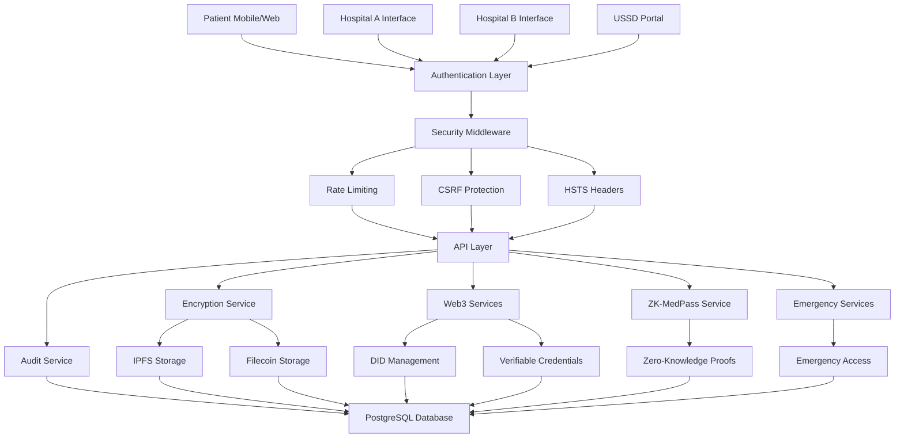

# 🏥 MediBridge - Healthcare Interoperability Powered by Hedera

<div align="center">


[](https://hedera.com)
[](https://medibrigde.onrender.com/)

**🏆 Bridging Healthcare with Hedera Hashgraph Technology**

*Solving Kenya's healthcare trust crisis through enterprise blockchain, zero-knowledge proofs, and USSD integration. 7,000+ lives lost annually from missing medical data—MediBridge changes that.*

**🏥 Mission:** Enabling seamless, secure sharing of patient medical records between hospitals while maintaining complete patient privacy through cryptographic consent, immutable audit trails on Hedera, and NFT-based access control.

[🚀 Live Demo](https://medibrigde.onrender.com/) • [📖 Hedera Integration](HEDERA_INTEGRATION.md) • [🔐 For Judges](#-for-judges-testing-the-mvp) • [💻 GitHub](#)

</div>

---

## 🚨 The Problem: 7,000 Lives Lost Annually

In Kenya, **over 7,000 people die every year from medication-related errors**—not from lack of doctors, but from missing data. Every hospital keeps its own records, many on paper, others locked in disconnected systems. When a patient moves, their history disappears.

**Key Challenges:**
- 📁 **12,000+ health facilities** with zero interoperability
- 🔄 **60% of diagnostics** are duplicates across hospitals  
- 💰 **KES 2.5B+ wasted annually** in redundant procedures
- 🚫 **Trust deficit**: Hospitals don't trust each other's records; patients don't trust hospitals
- 🔓 **No tamper-proof audit trail**: Traditional databases can be altered
- ❌ **No cryptographic consent**: Database flags can be manipulated

---

## 💡 The Solution: MediBridge + Hedera

MediBridge creates a **trusted digital highway** where medical records travel with the patient—securely, privately, instantly. Powered by **Hedera Hashgraph's enterprise blockchain**, we solve the trust problem through:

- ⚡ **10,000+ TPS** - Handles Kenya's entire healthcare system at scale
- 🔒 **Immutable Audit Trail** - Every action cryptographically verified on Hedera
- 💰 **$0.0001 per transaction** - Affordable for public healthcare
- 🌱 **Carbon Negative** - Aligns with Kenya's climate goals
- 🏛️ **Enterprise Governance** - Trusted by Google, IBM, Boeing

---

## 🔗 Hedera Integration: 1,160+ Lines of Production Code

MediBridge implements **5 comprehensive Hedera integrations**:

### 1. 🗂️ **Hedera Consensus Service (HCS): Immutable Audit Trail**
- **3 Dedicated Topics**: Audit (`0.0.7123958`), Consent (`0.0.7123959`), Security (`0.0.7123960`)
- **99% cost reduction**: Hash-only storage vs. full data on-chain
- **Tamper-evident**: Any database modification immediately detectable
- **Compliance**: HIPAA/GDPR cryptographic proof

### 2. 🎫 **Hedera Token Service (HTS): Medical Record NFTs**
- **Token ID**: `0.0.7123961`
- **Trustless consent**: Patient owns NFT = owns medical record
- **Instant revocation**: Freeze NFT to revoke access in seconds
- **Complete audit trail**: NFT transfer history on-chain

### 3. 📜 **Smart Contracts: Automated Consent Enforcement**
- **MediBridgeConsent.sol** deployed on Hedera
- **Zero-trust**: No admin can bypass consent rules
- **Auto-expiration**: Consent expires automatically after set period
- **Emergency override**: Special contracts with dual-authorization

### 4. 🆔 **Hedera DID: Portable Patient Identities**
- **Format**: `did:hedera:testnet:{accountId}_{publicKey}`
- **Universal ID**: Works across all hospitals nationwide
- **QR + USSD**: Accessible via smartphone or feature phone
- **Privacy-preserving**: Reveals nothing until patient consents

### 5. ⏰ **Scheduled Transactions: Auto-Expiration**
- **Guaranteed expiration**: Works even if servers fail
- **Zero maintenance**: No cron jobs or background workers
- **Patient control**: Temporary access truly temporary

**View on HashScan:**
- 🔍 [Audit Topic](https://hashscan.io/testnet/topic/0.0.7123958)
- 🔍 [Consent Topic](https://hashscan.io/testnet/topic/0.0.7123959)
- 🔍 [Security Topic](https://hashscan.io/testnet/topic/0.0.7123960)
- 🔍 [Medical NFT Token](https://hashscan.io/testnet/token/0.0.7123961)
- 🔍 [Operator Account](https://hashscan.io/testnet/account/0.0.7123857)

---

## 🧪 For Judges: Testing the MVP

### What You're Testing
**Fully functional MVP** with complete Hedera integration (not just a PoC):
- ✅ Patient registration with Hedera DID creation
- ✅ Hospital interfaces for data submission/retrieval
- ✅ NFT minting on Hedera for medical records
- ✅ Smart contract consent verification
- ✅ Immutable audit logging to HCS
- ✅ IPFS storage with AES-256 encryption
- ✅ Zero-knowledge proofs
- ✅ USSD integration for feature phones

### 🔑 Hedera Testnet Credentials
```
Network: Hedera Testnet
Account ID: 0.0.7123857
Balance: 1070+ tℏ (sufficient for testing)
Mirror Node: https://testnet.mirrornode.hedera.com
```
*Note: Private key configured on backend. Judges interact via UI.*

### 🚀 Quick Test Guide

**1. Access Live Demo:** https://medibrigde.onrender.com/

**2. Test Patient Registration (Creates Hedera DID)**
- Register with phone number
- ✅ Hedera DID created: `did:hedera:testnet:0.0.xxx`
- ✅ Account initialized on Hedera

**3. Test Record Upload (Mints NFT)**
- Login as Hospital A
- Upload medical record
- ✅ Encrypted with AES-256-GCM
- ✅ Stored on IPFS
- ✅ NFT minted on Hedera (Token: `0.0.7123961`)
- ✅ Audit logged to HCS (Topic: `0.0.7123958`)
- **Verify:** https://hashscan.io/testnet/token/0.0.7123961

**4. Test Consent Management (NFT Transfer)**
- Login as Patient
- Grant 7-day consent to Hospital B
- ✅ NFT transferred to Hospital B
- ✅ Smart contract records consent
- ✅ Scheduled transaction created (auto-revoke)
- ✅ Logged to HCS (Topic: `0.0.7123959`)
- **Verify:** https://hashscan.io/testnet/topic/0.0.7123959

**5. Test Record Retrieval (Smart Contract Check)**
- Login as Hospital B
- Request patient record
- ✅ Smart contract verifies consent on Hedera
- ✅ If valid → Record retrieved from IPFS
- ✅ Access logged to HCS

**6. Test Consent Revocation (NFT Freeze)**
- Login as Patient
- Revoke consent for Hospital B
- ✅ NFT frozen instantly
- ✅ Hospital B loses access
- ✅ Revocation logged to HCS

**7. Verify on Hedera**
All actions visible on public ledger:
- Audit trail: https://hashscan.io/testnet/topic/0.0.7123958
- Consent events: https://hashscan.io/testnet/topic/0.0.7123959
- Security logs: https://hashscan.io/testnet/topic/0.0.7123960
- NFT activity: https://hashscan.io/testnet/token/0.0.7123961

---

## 🌟 What Makes MediBridge Revolutionary?

### 🔐 **Military-Grade Security**
- **AES-256-GCM Encryption** with integrity verification and HMAC signatures
- **PBKDF2 Key Derivation** (100,000 iterations) with patient-specific salt
- **Multi-Factor Authentication** via SMS/Email OTP with multiple providers
- **HTTP Strict Transport Security (HSTS)** with preload and subdomain support
- **CSRF Protection** using modern csrf-csrf package
- **Rate Limiting** with intelligent endpoint-specific limits (5 auth attempts/15min, 3 emergency/hour)
- **Comprehensive Audit Logging** with real-time security violation tracking
- **Secure Key Vault** with master key encryption and access monitoring

### 🌐 **Hedera-Powered Web3 Integration**
- **Hedera Hashgraph** - Enterprise blockchain (10,000+ TPS, $0.0001/tx, carbon-negative)
- **Hedera Consensus Service (HCS)** - Immutable audit trail across 3 topics
- **Hedera Token Service (HTS)** - Medical record NFTs for consent management
- **Hedera Smart Contracts** - Automated consent enforcement (MediBridgeConsent.sol)
- **Hedera DID** - Portable patient identities (`did:hedera:testnet:xxx`)
- **Scheduled Transactions** - Automatic consent expiration
- **IPFS Storage** - Decentralized medical records with Pinata gateway
- **ZoKrates ZKP** - Privacy-preserving medical proof generation
- **Verifiable Credentials** - Cryptographic consent with JWT format

### 🔒 **Zero-Knowledge Proofs (ZK-MedPass)**
- **Privacy-Preserving Health Proofs** - Prove health status without revealing details
- **Age Verification** - Prove age requirements without revealing exact age
- **Allergy Proofs** - Share allergy information without exposing specific allergies
- **Condition Verification** - Prove medical conditions exist without revealing specifics
- **USSD Integration** - Access ZK proofs via mobile USSD codes
- **Proof Sharing** - Share anonymous proofs with employers, partners, clinics
- **Emergency ZK Mode** - Rapid proof sharing for emergency situations

### 🏥 **Healthcare-First Design**
- **Patient-Centric** - Patients control their data with cryptographic consent
- **Hospital Interoperability** - Seamless data sharing between Hospital A and B
- **Emergency Access** - Controlled emergency protocols with time-limited credentials
- **Consent Management** - Cryptographic consent verification with expiration
- **QR Code Lookup** - Instant patient identification via QR codes
- **Multi-Hospital Support** - Role-based access control for different hospital types
- **Staff Management** - Comprehensive staff invitation and profile management

### 📱 **Mobile & USSD Integration**
- **Africa's Talking Integration** - Voice calls, SMS, airtime rewards, USSD
- **USSD Health Portal** - Access health proofs via mobile USSD codes
- **Voice Call Notifications** - Emergency voice calls in multiple languages
- **Airtime Rewards** - Earn airtime for feedback and participation
- **Multi-Language Support** - English, Swahili, and other local languages
- **Emergency SMS** - Rapid emergency notifications to contacts

### 🚨 **Emergency & Recovery Systems**
- **Emergency Access Dashboard** - Real-time emergency credential management
- **Emergency Consent Service** - Dual-authorization emergency protocols
- **Emergency Credential Service** - Time-limited emergency access tokens
- **Patient Key Recovery** - Secure key recovery with QR codes and recovery phrases
- **Emergency ZK Mode** - Rapid zero-knowledge proof sharing
- **Next-of-Kin Notifications** - Automated emergency contact notifications

---

## 🚀 Quick Start

### ⚡ **Get Running in 5 Minutes**

```bash
# Clone the repository
git clone https://github.com/your-username/MediBridgeSystem.git
cd MediBridgeSystem

# Install dependencies
npm install

# Set up environment (copy and configure)
cp .env.example .env

# Run database migrations
npm run db:migrate

# Start development server
npm run dev
```

🎯 **Access the application at `http://localhost:5000`**

🌐 **Live Demo: [https://medibrigde.onrender.com/](https://medibrigde.onrender.com/)**

---

## 🏗️ Architecture Overview



---

## 🔐 Security Implementation Deep Dive

### **Enhanced Encryption & Key Management**
```typescript
// AES-256-GCM with integrity verification and HMAC
const cipher = crypto.createCipheriv('aes-256-gcm', key, iv);
cipher.setAAD(Buffer.from(patientDID)); // Additional authenticated data
const authTag = cipher.getAuthTag(); // Integrity verification
const integritySignature = crypto.createHmac('sha256', hmacKey)
  .update(recordString)
  .digest('hex');
```

### **Multi-Provider Authentication**
- **SMS OTP** via MSG91, Vonage, AWS SNS, SendGrid, Plivo
- **Email OTP** via SendGrid with template support
- **Session Management** with Redis and secure cookies
- **Rate Limiting** on authentication endpoints with audit logging

### **Comprehensive Audit & Compliance**
```typescript
// Real-time security violation tracking
await auditService.logSecurityViolation({
  violationType: "RATE_LIMIT_EXCEEDED",
  severity: "medium",
  actorId: req.ip || "unknown",
  targetResource: `${endpointType}:${req.path}`,
  details: { endpointType, path: req.path, method: req.method },
}, req);
```

---

## 🌐 Web3 Features Showcase

### **Decentralized Identity (DID)**
```typescript
// Auto-generate patient DID from phone number
const did = didService.generateDID(publicKey);
const didDocument = didService.createDIDDocument(did, publicKey);
```

### **Verifiable Credentials**
```typescript
// Issue consent credential with expiration
const vc = await vcService.issueCredential({
  type: "HealthcareConsent",
  issuer: patientDID,
  subject: hospitalDID,
  contentHash: recordHash,
  expiresAt: consentExpiry
});
```

### **IPFS Integration with Monitoring**
```typescript
// Store encrypted record on IPFS with health monitoring
const ipfsResult = await ipfsService.storeRecord(encryptedData);
const cid = ipfsResult.cid;
// Real-time IPFS status monitoring with availability tracking
```

---

## 🔒 Zero-Knowledge Proofs (ZK-MedPass)

### **Privacy-Preserving Health Proofs**
```typescript
// Generate ZK proof for health condition without revealing details
const proof = await zkpService.generateConditionProof(
  patientDID,
  condition,
  "Patient has valid health status",
  30 // expires in 30 days
);
```

### **USSD Integration**
- **Mobile USSD Portal** - Access health proofs via *384*1234#
- **Multi-Language Support** - English and Swahili menus
- **Proof Sharing** - Share anonymous proofs with employers/clinics
- **Airtime Rewards** - Earn airtime for feedback and participation

### **Emergency ZK Mode**
```typescript
// Rapid emergency proof sharing
await zkpService.emergencyMode({
  patientDID,
  emergencyContacts: ["+254123456789"]
});
```

---

## 📱 User Experience

### **For Patients**
- 🆔 **Simple Registration** - Phone/email only, no crypto knowledge needed
- 📱 **QR Code Identity** - Show QR to hospital staff for instant lookup
- 🔐 **Consent Dashboard** - Control who accesses your records
- 🚨 **Emergency Access** - Temporary access for critical situations
- 🔑 **Key Recovery** - Secure recovery with QR codes and recovery phrases
- 📞 **USSD Portal** - Access health proofs via mobile USSD
- 🎁 **Airtime Rewards** - Earn airtime for feedback and participation
- 🔒 **ZK Proofs** - Share health status without revealing details

### **For Hospitals**
- 🏥 **Hospital A Interface** - Submit and manage patient records
- 🔍 **Hospital B Interface** - Search and access with patient consent
- 👥 **Staff Management** - Invite and manage hospital staff with profiles
- 🚨 **Emergency Authorization** - Grant emergency access with dual approval
- 📊 **Audit Dashboard** - Monitor all access and security events
- 🔐 **Consent Verification** - Verify patient consent cryptographically
- 📱 **QR Code Scanning** - Instant patient identification

### **For Administrators**
- 🛡️ **Security Monitoring** - Real-time security violation tracking
- 📈 **Analytics Dashboard** - Usage statistics and trends
- 🔧 **System Management** - Configure security settings
- 📋 **Compliance Reports** - Generate audit reports
- 👥 **Staff Management** - Comprehensive staff invitation system
- 🔄 **Rate Limit Monitoring** - Track and manage API usage
- 🚨 **Emergency Oversight** - Monitor emergency access events

---

## 🛡️ Security Features Matrix

| Feature | Implementation | Security Level |
|---------|---------------|----------------|
| **Encryption** | AES-256-GCM + PBKDF2 + HMAC | 🔒 Military Grade |
| **Authentication** | MFA + Session Management + Rate Limiting | 🔒 Enterprise |
| **Authorization** | Role-Based Access Control + Consent | 🔒 Healthcare |
| **Audit Logging** | Comprehensive + Real-time + Violations | 🔒 Compliance |
| **Rate Limiting** | Endpoint-specific + Audit logging | 🔒 DDoS Protection |
| **CSRF Protection** | Modern csrf-csrf + Token validation | 🔒 Web Security |
| **HSTS** | Preload + Subdomains + Health checks | 🔒 Transport Security |
| **Input Validation** | Zod schemas + Sanitization | 🔒 Injection Protection |
| **Zero-Knowledge** | Poseidon hashing + Privacy proofs | 🔒 Privacy Preserving |
| **Emergency Access** | Time-limited + Dual authorization | 🔒 Emergency Protocols |

---

## 📊 Performance & Scalability

### **Database Optimization**
- **Indexed Queries** for fast patient lookups
- **Connection Pooling** for efficient database usage
- **Drizzle ORM** for type-safe queries
- **Migration Management** for schema updates

### **Caching Strategy**
- **Redis Caching** for session management
- **Query Result Caching** for frequently accessed data
- **IPFS Content Caching** for faster retrieval
- **CDN Integration** for static assets

### **Monitoring & Logging**
- **Real-time Performance Monitoring**
- **Error Tracking** and alerting
- **Usage Analytics** and metrics
- **Health Check Endpoints**
- **IPFS Status Monitoring** with availability tracking

---

## 🧪 Testing & Quality Assurance

### **Security Testing**
```bash
# Test HSTS implementation
curl -I http://localhost:5000/api/security/hsts-health

# Test CSRF protection
curl -I http://localhost:5000/api/csrf-health

# Test security headers
curl -I http://localhost:5000/api/security/headers-test

# Test ZK proof generation
curl -X POST http://localhost:5000/api/zk-medpass/generate-proof
```

### **API Testing**
- **Unit Tests** for all core functions
- **Integration Tests** for API endpoints
- **End-to-End Tests** for user workflows
- **Security Tests** for authentication and authorization
- **ZK Proof Tests** for privacy-preserving features

---

## 🚀 Deployment

### **Production Setup**
```bash
# Build for production
npm run build

# Set environment variables
export NODE_ENV=production
export DATABASE_URL=postgresql://...
export SESSION_SECRET=your_very_strong_secret
export MASTER_KEY=your_master_key
export AFRICAS_TALKING_API_KEY=your_at_key

# Start production server
npm start
```

### **Docker Deployment**
```dockerfile
# Multi-stage build for optimized production image
FROM node:18-alpine AS builder
WORKDIR /app
COPY package*.json ./
RUN npm ci --only=production

FROM node:18-alpine AS production
WORKDIR /app
COPY --from=builder /app/node_modules ./node_modules
COPY . .
EXPOSE 5000
CMD ["npm", "start"]
```

---

## 📈 Impact & Innovation

### **Healthcare Impact**
- ✅ **Patient Privacy** - Cryptographic consent control with ZK proofs
- ✅ **Data Security** - Military-grade encryption with integrity verification
- ✅ **Interoperability** - Seamless hospital data sharing
- ✅ **Emergency Access** - Controlled emergency protocols with time limits
- ✅ **Compliance** - HIPAA and local healthcare regulations
- ✅ **Mobile Access** - USSD integration for rural areas
- ✅ **Financial Inclusion** - Airtime rewards for participation

### **Technical Innovation**
- 🚀 **Web3 Integration** - First healthcare platform with DID + IPFS + ZK
- 🔐 **Security First** - Comprehensive security implementation
- 📱 **User Experience** - Simple interface for complex technology
- 🌍 **Scalability** - Designed for global healthcare networks
- 🔄 **Interoperability** - Standards-compliant data exchange
- 🔒 **Privacy Preserving** - Zero-knowledge proofs for health data
- 📞 **Mobile Integration** - USSD and voice call capabilities

---

## 🏆 Technical Achievements

### **Hedera Integration (1,160+ Lines of Code)**
- ✅ **HCS Audit Trail** - 3 dedicated topics for immutable logging (~200 lines)
- ✅ **HTS Medical NFTs** - Token-based consent management (~220 lines)
- ✅ **Smart Contracts** - MediBridgeConsent.sol on Hedera (~400 lines)
- ✅ **Hedera DID** - Portable patient identities (~150 lines)
- ✅ **Scheduled Transactions** - Auto-expiring consent (~160 lines)
- ✅ **Mirror Node Integration** - Fast historical queries (~30 lines)

### **Complete Healthcare Platform**
- ✅ **Zero-Knowledge Proofs** - Privacy-preserving health verification
- ✅ **USSD Integration** - Feature phone access via Africa's Talking
- ✅ **Enterprise Security** - AES-256, HSTS, CSRF, Rate Limiting
- ✅ **HIPAA Compliance** - Healthcare-grade data handling
- ✅ **Emergency Protocols** - Time-limited emergency access with dual-auth
- ✅ **IPFS Storage** - Decentralized encrypted medical records
- ✅ **Production Deployment** - Live on Render with PostgreSQL

### **Innovation Highlights**
- 🎯 **First Hedera Healthcare DID Platform** - Patient-controlled identities on enterprise blockchain
- 🔐 **NFT-Based Consent** - Medical records as NFTs for trustless access control
- 🌐 **Immutable Audit Trail** - Every action cryptographically verified on Hedera
- 📱 **QR + USSD Integration** - Works on smartphones and feature phones
- 🚨 **Smart Contract Enforcement** - Zero-trust consent verification
- 🔒 **ZK-MedPass** - Privacy-preserving health proofs
- ⏰ **Scheduled Auto-Revocation** - Guaranteed consent expiration
- 💰 **99% Cost Reduction** - Hash anchoring vs. full on-chain storage

---

## 👥 Team

<div align="center">

### **Brandon Mwenja** 
**🏆 Fullstack Engineer | Kenya**

*"Building the future of healthcare data interoperability with Hedera Hashgraph"*

**Expertise:**
- 🏗️ System Architecture & Design
- ⛓️ **Hedera Integration** (HCS, HTS, Smart Contracts, DID, Scheduled Transactions)
- 🔐 Security Implementation (AES-256, HSTS, CSRF, Rate Limiting)
- 🌐 Web3 Integration (DID, IPFS, Verifiable Credentials)
- 🔒 Zero-Knowledge Proofs (ZK-MedPass, Privacy Preserving)
- 📞 Mobile Integration (USSD, Voice Calls, SMS)
- 🎨 Frontend Development (React, TypeScript)
- ⚙️ Backend Development (Node.js, PostgreSQL, Redis)
- 📊 Database Design & Optimization

**Key Achievements:**
- ✅ **1,160+ lines of Hedera integration** across 6 core services
- ✅ Implemented **HCS audit trail** with 3 dedicated topics
- ✅ Built **HTS NFT system** for medical record consent management
- ✅ Deployed **smart contracts** on Hedera for automated consent
- ✅ Created **Hedera DID system** for portable patient identities
- ✅ Implemented **scheduled transactions** for auto-expiring consent
- ✅ Military-grade encryption (AES-256-GCM + PBKDF2 + HMAC)
- ✅ Zero-knowledge proof system for privacy-preserving health data
- ✅ USSD integration for feature phone access
- ✅ HIPAA compliance with immutable audit trail

</div>

---

## 🔮 Future Roadmap

### **Phase 2: Advanced Features**
- 🤖 **AI Analytics** - Population health insights with privacy preservation
- 📱 **Mobile App** - Native iOS/Android applications
- 🌍 **Global Expansion** - Multi-country deployment
- 🔗 **FHIR Integration** - Healthcare standards compliance
- 🧬 **Genomic Data** - Secure genomic information sharing with ZK proofs
- 🏥 **Hospital Network** - Multi-hospital partnerships
- 📊 **Research Platform** - Anonymized data for research with ZK proofs

### **Phase 3: Ecosystem**
- 🏛️ **Government Integration** - National health registries
- 🏥 **Hospital Network** - Multi-hospital partnerships
- 📊 **Research Platform** - Anonymized data for research
- 🔬 **Clinical Trials** - Secure trial data management with ZK proofs
- 🌐 **Global Standards** - International healthcare protocols
- 💰 **Token Economics** - Incentivized participation and data sharing
- 🔗 **Interoperability** - Integration with existing health systems

---

## 📞 Connect & Support

<div align="center">

**🚀 Ready to revolutionize healthcare data sharing?**

[🌐 Live Demo](https://medibrigde.onrender.com/) • [📖 Hedera Integration](HEDERA_INTEGRATION.md) • [🔍 HashScan](https://hashscan.io/testnet/account/0.0.7123857) • [📧 Contact](#)

**View MediBridge on Hedera:**
- [Audit Topic](https://hashscan.io/testnet/topic/0.0.7123958) • [Consent Topic](https://hashscan.io/testnet/topic/0.0.7123959) • [Security Topic](https://hashscan.io/testnet/topic/0.0.7123960)
- [Medical NFT Token](https://hashscan.io/testnet/token/0.0.7123961) • [Operator Account](https://hashscan.io/testnet/account/0.0.7123857)

---

*MediBridge - Where Healthcare Meets Hedera Innovation*

**Powered by Hedera Hashgraph** | **Built for Kenya** | **Designed for the Future**

</div>

---
