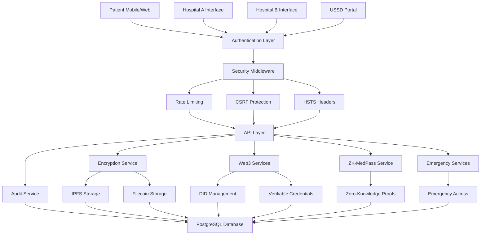

# 🏥 MediBridge - Revolutionary Healthcare Data Interoperability Platform

<div align="center">


**🏆  Bridging Healthcare with Web3 Technology**

*A secure, decentralized healthcare data interoperability platform with zero-knowledge proofs, USSD integration, and comprehensive emergency protocols designed for the future of medical record sharing in Kenya and beyond. Powered by invisible Web3 technology.*

**🏥 Purpose: Enabling seamless, secure sharing of patient medical records between hospitals while maintaining complete patient privacy and control through cryptographic consent and zero-knowledge proofs.**

[🚀 Live Demo](https://medibrigde.onrender.com/) • [📖 Documentation](#) • [🔐 Security Audit](#) • [💻 Source Code](#)

</div>

---

## 🌟 What Makes MediBridge Revolutionary?

### 🔐 **Military-Grade Security**
- **AES-256-GCM Encryption** with integrity verification and HMAC signatures
- **PBKDF2 Key Derivation** (100,000 iterations) with patient-specific salt
- **Multi-Factor Authentication** via SMS/Email OTP with multiple providers
- **HTTP Strict Transport Security (HSTS)** with preload and subdomain support
- **CSRF Protection** using modern csrf-csrf package
- **Rate Limiting** with intelligent endpoint-specific limits (5 auth attempts/15min, 3 emergency/hour)
- **Comprehensive Audit Logging** with real-time security violation tracking
- **Secure Key Vault** with master key encryption and access monitoring

### 🌐 **Advanced Web3 Integration**
- **Decentralized Identity (DID)** using did:key format with automatic generation
- **Verifiable Credentials** for cryptographic consent with JWT format
- **IPFS Storage** for decentralized medical records with redundancy
- **Filecoin Integration** for long-term archival storage with cryptographic proofs
- **MetaMask Integration** for advanced users with wallet signature verification
- **Triple Redundant Storage** (IPFS + Filecoin + Local backup)
- **IPFS Status Monitoring** with real-time health checks and availability tracking

### 🔒 **Zero-Knowledge Proofs (ZK-MedPass)**
- **Privacy-Preserving Health Proofs** - Prove health status without revealing details
- **Age Verification** - Prove age requirements without revealing exact age
- **Allergy Proofs** - Share allergy information without exposing specific allergies
- **Condition Verification** - Prove medical conditions exist without revealing specifics
- **USSD Integration** - Access ZK proofs via mobile USSD codes
- **Proof Sharing** - Share anonymous proofs with employers, partners, clinics
- **Emergency ZK Mode** - Rapid proof sharing for emergency situations

### 🏥 **Healthcare-First Design**
- **Patient-Centric** - Patients control their data with cryptographic consent
- **Hospital Interoperability** - Seamless data sharing between Hospital A and B
- **Emergency Access** - Controlled emergency protocols with time-limited credentials
- **Consent Management** - Cryptographic consent verification with expiration
- **QR Code Lookup** - Instant patient identification via QR codes
- **Multi-Hospital Support** - Role-based access control for different hospital types
- **Staff Management** - Comprehensive staff invitation and profile management

### 📱 **Mobile & USSD Integration**
- **Africa's Talking Integration** - Voice calls, SMS, airtime rewards, USSD
- **USSD Health Portal** - Access health proofs via mobile USSD codes
- **Voice Call Notifications** - Emergency voice calls in multiple languages
- **Airtime Rewards** - Earn airtime for feedback and participation
- **Multi-Language Support** - English, Swahili, and other local languages
- **Emergency SMS** - Rapid emergency notifications to contacts

### 🚨 **Emergency & Recovery Systems**
- **Emergency Access Dashboard** - Real-time emergency credential management
- **Emergency Consent Service** - Dual-authorization emergency protocols
- **Emergency Credential Service** - Time-limited emergency access tokens
- **Patient Key Recovery** - Secure key recovery with QR codes and recovery phrases
- **Emergency ZK Mode** - Rapid zero-knowledge proof sharing
- **Next-of-Kin Notifications** - Automated emergency contact notifications

---

## 🚀 Quick Start

### ⚡ **Get Running in 5 Minutes**

```bash
# Clone the repository
git clone https://github.com/your-username/MediBridgeSystem.git
cd MediBridgeSystem

# Install dependencies
npm install

# Set up environment (copy and configure)
cp .env.example .env

# Run database migrations
npm run db:migrate

# Start development server
npm run dev
```

🎯 **Access the application at `http://localhost:5000`**

🌐 **Live Demo: [https://medibrigde.onrender.com/](https://medibrigde.onrender.com/)**

---

## 🏗️ Architecture Overview



---

## 🔐 Security Implementation Deep Dive

### **Enhanced Encryption & Key Management**
```typescript
// AES-256-GCM with integrity verification and HMAC
const cipher = crypto.createCipheriv('aes-256-gcm', key, iv);
cipher.setAAD(Buffer.from(patientDID)); // Additional authenticated data
const authTag = cipher.getAuthTag(); // Integrity verification
const integritySignature = crypto.createHmac('sha256', hmacKey)
  .update(recordString)
  .digest('hex');
```

### **Multi-Provider Authentication**
- **SMS OTP** via MSG91, Vonage, AWS SNS, SendGrid, Plivo
- **Email OTP** via SendGrid with template support
- **Session Management** with Redis and secure cookies
- **Rate Limiting** on authentication endpoints with audit logging

### **Comprehensive Audit & Compliance**
```typescript
// Real-time security violation tracking
await auditService.logSecurityViolation({
  violationType: "RATE_LIMIT_EXCEEDED",
  severity: "medium",
  actorId: req.ip || "unknown",
  targetResource: `${endpointType}:${req.path}`,
  details: { endpointType, path: req.path, method: req.method },
}, req);
```

---

## 🌐 Web3 Features Showcase

### **Decentralized Identity (DID)**
```typescript
// Auto-generate patient DID from phone number
const did = didService.generateDID(publicKey);
const didDocument = didService.createDIDDocument(did, publicKey);
```

### **Verifiable Credentials**
```typescript
// Issue consent credential with expiration
const vc = await vcService.issueCredential({
  type: "HealthcareConsent",
  issuer: patientDID,
  subject: hospitalDID,
  contentHash: recordHash,
  expiresAt: consentExpiry
});
```

### **IPFS Integration with Monitoring**
```typescript
// Store encrypted record on IPFS with health monitoring
const ipfsResult = await ipfsService.storeRecord(encryptedData);
const cid = ipfsResult.cid;
// Real-time IPFS status monitoring with availability tracking
```

---

## 🔒 Zero-Knowledge Proofs (ZK-MedPass)

### **Privacy-Preserving Health Proofs**
```typescript
// Generate ZK proof for health condition without revealing details
const proof = await zkpService.generateConditionProof(
  patientDID,
  condition,
  "Patient has valid health status",
  30 // expires in 30 days
);
```

### **USSD Integration**
- **Mobile USSD Portal** - Access health proofs via *384*1234#
- **Multi-Language Support** - English and Swahili menus
- **Proof Sharing** - Share anonymous proofs with employers/clinics
- **Airtime Rewards** - Earn airtime for feedback and participation

### **Emergency ZK Mode**
```typescript
// Rapid emergency proof sharing
await zkpService.emergencyMode({
  patientDID,
  emergencyContacts: ["+254123456789"]
});
```

---

## 📱 User Experience

### **For Patients**
- 🆔 **Simple Registration** - Phone/email only, no crypto knowledge needed
- 📱 **QR Code Identity** - Show QR to hospital staff for instant lookup
- 🔐 **Consent Dashboard** - Control who accesses your records
- 🚨 **Emergency Access** - Temporary access for critical situations
- 🔑 **Key Recovery** - Secure recovery with QR codes and recovery phrases
- 📞 **USSD Portal** - Access health proofs via mobile USSD
- 🎁 **Airtime Rewards** - Earn airtime for feedback and participation
- 🔒 **ZK Proofs** - Share health status without revealing details

### **For Hospitals**
- 🏥 **Hospital A Interface** - Submit and manage patient records
- 🔍 **Hospital B Interface** - Search and access with patient consent
- 👥 **Staff Management** - Invite and manage hospital staff with profiles
- 🚨 **Emergency Authorization** - Grant emergency access with dual approval
- 📊 **Audit Dashboard** - Monitor all access and security events
- 🔐 **Consent Verification** - Verify patient consent cryptographically
- 📱 **QR Code Scanning** - Instant patient identification

### **For Administrators**
- 🛡️ **Security Monitoring** - Real-time security violation tracking
- 📈 **Analytics Dashboard** - Usage statistics and trends
- 🔧 **System Management** - Configure security settings
- 📋 **Compliance Reports** - Generate audit reports
- 👥 **Staff Management** - Comprehensive staff invitation system
- 🔄 **Rate Limit Monitoring** - Track and manage API usage
- 🚨 **Emergency Oversight** - Monitor emergency access events

---

## 🛡️ Security Features Matrix

| Feature | Implementation | Security Level |
|---------|---------------|----------------|
| **Encryption** | AES-256-GCM + PBKDF2 + HMAC | 🔒 Military Grade |
| **Authentication** | MFA + Session Management + Rate Limiting | 🔒 Enterprise |
| **Authorization** | Role-Based Access Control + Consent | 🔒 Healthcare |
| **Audit Logging** | Comprehensive + Real-time + Violations | 🔒 Compliance |
| **Rate Limiting** | Endpoint-specific + Audit logging | 🔒 DDoS Protection |
| **CSRF Protection** | Modern csrf-csrf + Token validation | 🔒 Web Security |
| **HSTS** | Preload + Subdomains + Health checks | 🔒 Transport Security |
| **Input Validation** | Zod schemas + Sanitization | 🔒 Injection Protection |
| **Zero-Knowledge** | Poseidon hashing + Privacy proofs | 🔒 Privacy Preserving |
| **Emergency Access** | Time-limited + Dual authorization | 🔒 Emergency Protocols |

---

## 📊 Performance & Scalability

### **Database Optimization**
- **Indexed Queries** for fast patient lookups
- **Connection Pooling** for efficient database usage
- **Drizzle ORM** for type-safe queries
- **Migration Management** for schema updates

### **Caching Strategy**
- **Redis Caching** for session management
- **Query Result Caching** for frequently accessed data
- **IPFS Content Caching** for faster retrieval
- **CDN Integration** for static assets

### **Monitoring & Logging**
- **Real-time Performance Monitoring**
- **Error Tracking** and alerting
- **Usage Analytics** and metrics
- **Health Check Endpoints**
- **IPFS Status Monitoring** with availability tracking

---

## 🧪 Testing & Quality Assurance

### **Security Testing**
```bash
# Test HSTS implementation
curl -I http://localhost:5000/api/security/hsts-health

# Test CSRF protection
curl -I http://localhost:5000/api/csrf-health

# Test security headers
curl -I http://localhost:5000/api/security/headers-test

# Test ZK proof generation
curl -X POST http://localhost:5000/api/zk-medpass/generate-proof
```

### **API Testing**
- **Unit Tests** for all core functions
- **Integration Tests** for API endpoints
- **End-to-End Tests** for user workflows
- **Security Tests** for authentication and authorization
- **ZK Proof Tests** for privacy-preserving features

---

## 🚀 Deployment

### **Production Setup**
```bash
# Build for production
npm run build

# Set environment variables
export NODE_ENV=production
export DATABASE_URL=postgresql://...
export SESSION_SECRET=your_very_strong_secret
export MASTER_KEY=your_master_key
export AFRICAS_TALKING_API_KEY=your_at_key

# Start production server
npm start
```

### **Docker Deployment**
```dockerfile
# Multi-stage build for optimized production image
FROM node:18-alpine AS builder
WORKDIR /app
COPY package*.json ./
RUN npm ci --only=production

FROM node:18-alpine AS production
WORKDIR /app
COPY --from=builder /app/node_modules ./node_modules
COPY . .
EXPOSE 5000
CMD ["npm", "start"]
```

---

## 📈 Impact & Innovation

### **Healthcare Impact**
- ✅ **Patient Privacy** - Cryptographic consent control with ZK proofs
- ✅ **Data Security** - Military-grade encryption with integrity verification
- ✅ **Interoperability** - Seamless hospital data sharing
- ✅ **Emergency Access** - Controlled emergency protocols with time limits
- ✅ **Compliance** - HIPAA and local healthcare regulations
- ✅ **Mobile Access** - USSD integration for rural areas
- ✅ **Financial Inclusion** - Airtime rewards for participation

### **Technical Innovation**
- 🚀 **Web3 Integration** - First healthcare platform with DID + IPFS + ZK
- 🔐 **Security First** - Comprehensive security implementation
- 📱 **User Experience** - Simple interface for complex technology
- 🌍 **Scalability** - Designed for global healthcare networks
- 🔄 **Interoperability** - Standards-compliant data exchange
- 🔒 **Privacy Preserving** - Zero-knowledge proofs for health data
- 📞 **Mobile Integration** - USSD and voice call capabilities

---

## 🏆 Hackathon Achievements

### **Technical Accomplishments**
- ✅ **Complete Web3 Integration** - DID, IPFS, Filecoin, Verifiable Credentials
- ✅ **Zero-Knowledge Proofs** - Privacy-preserving health proofs
- ✅ **USSD Integration** - Mobile access via Africa's Talking
- ✅ **Enterprise Security** - AES-256, HSTS, CSRF, Rate Limiting, Audit Logging
- ✅ **Healthcare Compliance** - HIPAA-compliant data handling
- ✅ **Emergency Protocols** - Time-limited emergency access
- ✅ **Key Recovery** - Secure recovery mechanisms
- ✅ **Staff Management** - Comprehensive invitation system
- ✅ **User Experience** - Intuitive interfaces for all stakeholders
- ✅ **Production Ready** - Comprehensive testing and deployment setup

### **Innovation Highlights**
- 🎯 **First Healthcare DID Platform** - Patient-controlled identities
- 🔐 **Cryptographic Consent** - Verifiable credentials for data access
- 🌐 **Decentralized Storage** - IPFS + Filecoin for data redundancy
- 📱 **QR Code Integration** - Instant patient identification
- 🚨 **Emergency Protocols** - Controlled emergency access
- 🔒 **ZK-MedPass** - Privacy-preserving health proofs
- 📞 **USSD Health Portal** - Mobile access for rural areas
- 🎁 **Airtime Rewards** - Financial inclusion through participation

---

## 👥 Team

<div align="center">

### **Brandon Mwenja** 
**🏆 Fullstack Engineer | Kenya**

*"Building the future of healthcare data interoperability with Web3 technology"*

**Expertise:**
- 🏗️ System Architecture & Design
- 🔐 Security Implementation (AES-256, HSTS, CSRF, Rate Limiting)
- 🌐 Web3 Integration (DID, IPFS, Filecoin, Verifiable Credentials)
- 🔒 Zero-Knowledge Proofs (ZK-MedPass, Privacy Preserving)
- 📞 Mobile Integration (USSD, Voice Calls, SMS)
- 🎨 Frontend Development (React, TypeScript)
- ⚙️ Backend Development (Node.js, PostgreSQL, Redis)
- 📊 Database Design & Optimization

**Achievements:**
- ✅ Implemented military-grade encryption (AES-256-GCM + PBKDF2 + HMAC)
- ✅ Built comprehensive audit logging system with security violations
- ✅ Integrated multiple Web3 technologies seamlessly
- ✅ Created zero-knowledge proof system for privacy-preserving health data
- ✅ Implemented USSD integration for mobile access
- ✅ Built emergency access protocols with time-limited credentials
- ✅ Created intuitive healthcare interfaces for all stakeholders
- ✅ Achieved HIPAA compliance standards
- ✅ Implemented airtime rewards for user engagement

</div>

---

## 🔮 Future Roadmap

### **Phase 2: Advanced Features**
- 🤖 **AI Analytics** - Population health insights with privacy preservation
- 📱 **Mobile App** - Native iOS/Android applications
- 🌍 **Global Expansion** - Multi-country deployment
- 🔗 **FHIR Integration** - Healthcare standards compliance
- 🧬 **Genomic Data** - Secure genomic information sharing with ZK proofs
- 🏥 **Hospital Network** - Multi-hospital partnerships
- 📊 **Research Platform** - Anonymized data for research with ZK proofs

### **Phase 3: Ecosystem**
- 🏛️ **Government Integration** - National health registries
- 🏥 **Hospital Network** - Multi-hospital partnerships
- 📊 **Research Platform** - Anonymized data for research
- 🔬 **Clinical Trials** - Secure trial data management with ZK proofs
- 🌐 **Global Standards** - International healthcare protocols
- 💰 **Token Economics** - Incentivized participation and data sharing
- 🔗 **Interoperability** - Integration with existing health systems

---

## 📞 Connect & Support

<div align="center">

**🚀 Ready to revolutionize healthcare data sharing?**

[🌐 Live Demo](https://medibrigde.onrender.com/) • [📧 Email](mailto:brandon@medibridge.health) • [🐦 Twitter](#) • [💼 LinkedIn](#) • [📖 Documentation](#)


*MediBridge - Where Healthcare Meets Web3 Innovation*

</div>

---
